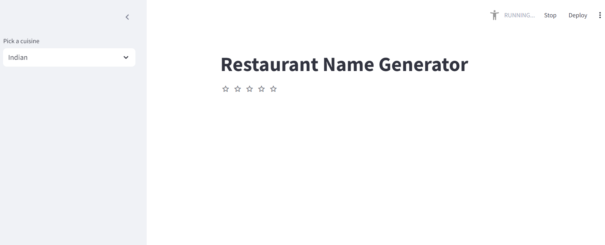

# Restaurant Name & Menu Generator

A project leveraging a Language Learning Model (LLM) to generate creative restaurant names and suggest menu items based on the input cuisine type. This project demonstrates the power of natural language processing to enhance user experiences in creative industries.

## Features

- **Cuisine-based Restaurant Name Generation:**
  Provide a cuisine type (e.g., Italian, Japanese, Mexican), and the model will suggest creative and relevant restaurant names.

- **Menu Item Suggestions:**
  Based on the chosen cuisine, the model will generate a list of typical or innovative menu items.

## How It Works

1. **Input:**
   - Specify the type of cuisine (e.g., "Indian," "French," "Korean").

2. **Processing:**
   - The LLM processes the input and uses pre-trained knowledge to suggest:
     - A creative restaurant name.
     - A list of menu items aligned with the cuisine type.

3. **Output:**
   - Receive the generated restaurant name and menu suggestions.

## Example

### Input:
```


```

### Output:
```


```

## Installation

1. Clone the repository:
   ```bash
   git clone clone-url
   cd restuarantNameGenerator
   ```

2. Set up the environment:
   ```bash
   Install pycharm
   Create account in Huggingface
   Create API key
   Set up our token access
   ```

3. Run the application:
   ```bash
   streamlit run .\main.py
   ```

## Usage

- Launch the application (e.g., as a web app or CLI tool).
- Select the cuisine type in the input field or CLI prompt.
- View the generated restaurant name and menu items.

## Technologies Used

- **Python**: Core programming language.
- **Huggingface Meta-Llama-3-8B-Instruct API**: For LLM-based name and menu generation.
- **streamlit** User interface

## Roadmap

- Add support for regional or fusion cuisines.
- Enable customization of menu length and style.
- Integrate user feedback to refine suggestions.
- Deploy as a mobile or web application for end-users.

## Contributing

Contributions are welcome! Please follow these steps:

1. Fork the repository.
2. Create a new branch (`feature/new-feature` or `bugfix/issue-id`).
3. Commit your changes.
4. Push to your branch and submit a pull request.


---

Feel free to modify and expand this README to suit the specific details and scope of your project.
